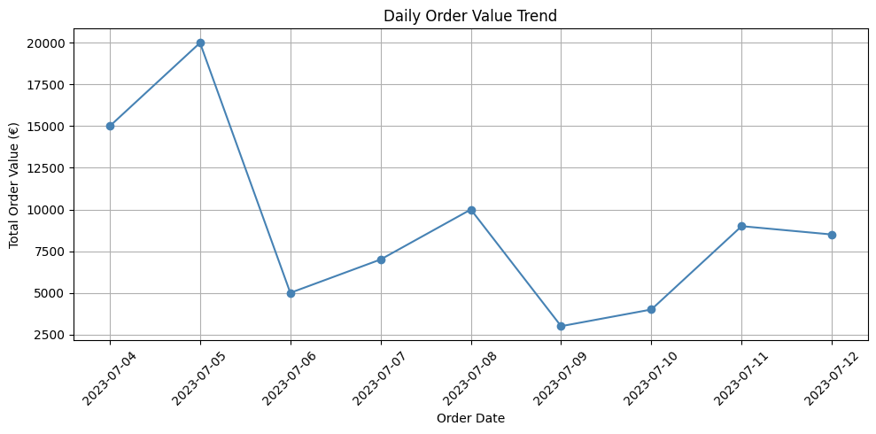
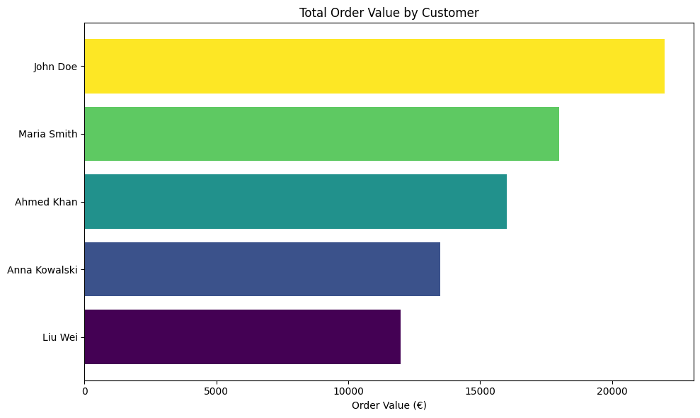
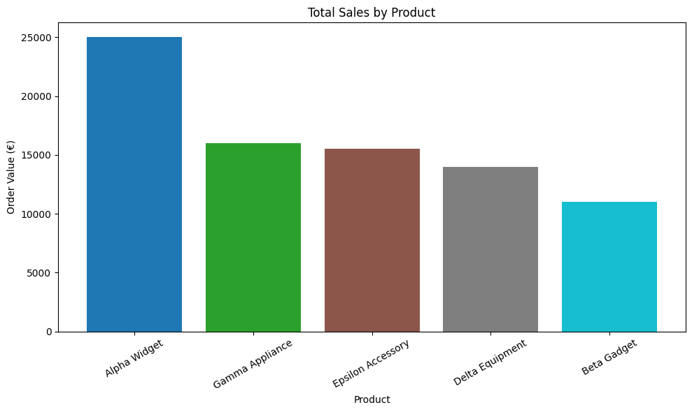

# Retail BI Case Study (Portfolio Project)

This project demonstrates a small-scale Business Intelligence (BI) analysis using simulated retail data.  
It was created as a personal portfolio piece using Python and matplotlib.

---

## 🧼 Data Preparation

We used three CSV files (Customers, Orders, Products) and merged them into a single dataset.

```python
import pandas as pd
import matplotlib.pyplot as plt
import numpy as np
from google.colab import files

# Upload CSVs from local
uploaded = files.upload()

# Read data
customers_df = pd.read_csv("Customers - Customers.csv")
orders_df = pd.read_csv("Customers - Orders.csv")
products_df = pd.read_csv("Customers - Products.csv")

# Convert OrderDate to datetime
orders_df['OrderDate'] = pd.to_datetime(orders_df['OrderDate'], dayfirst=True)

# Merge datasets
orders_customers = orders_df.merge(customers_df, on="CustomerID")
full_data = orders_customers.merge(products_df, on="ProductID")
```

---

## 📈 Daily Order Value Trend

We visualized the daily revenue pattern using a line chart.



```python
daily_trend = orders_df.groupby('OrderDate')['OrderValue'].sum().reset_index()

plt.figure(figsize=(10, 5))
plt.plot(daily_trend['OrderDate'], daily_trend['OrderValue'], marker='o', color='steelblue')
plt.title('Daily Order Value Trend')
plt.xlabel('Order Date')
plt.ylabel('Total Order Value (€)')
plt.grid(True)
plt.xticks(rotation=45)
plt.tight_layout()
plt.savefig("images/daily_order_trend.png")
plt.show()
```

---

## 👥 Total Sales by Customer

This horizontal bar chart displays which customers generated the most revenue.



```python
segment_summary = orders_df.merge(customers_df, on="CustomerID").groupby('Name')['OrderValue'].sum().reset_index().sort_values(by='OrderValue')

colors = plt.cm.viridis(np.linspace(0, 1, len(segment_summary)))
plt.figure(figsize=(10, 6))
plt.barh(segment_summary['Name'], segment_summary['OrderValue'], color=colors)
plt.title('Total Order Value by Customer')
plt.xlabel('Order Value (€)')
plt.tight_layout()
plt.savefig("images/customer_sales.png")
plt.show()
```

---

## 📦 Total Sales by Product

The chart below showcases product-level revenue performance.



```python
product_sales = orders_df.merge(products_df, on="ProductID")
summary = product_sales.groupby('ProductName')['OrderValue'].sum().reset_index().sort_values(by='OrderValue', ascending=False)

colors = plt.cm.tab10(np.linspace(0, 1, len(summary)))
plt.figure(figsize=(10, 6))
plt.bar(summary['ProductName'], summary['OrderValue'], color=colors)
plt.title('Total Sales by Product')
plt.ylabel('Order Value (€)')
plt.xlabel('Product')
plt.xticks(rotation=30)
plt.tight_layout()
plt.savefig("images/product_sales.png")
plt.show()
```

---

## 🛠️ Tools Used

- Python 3
- pandas
- matplotlib
- Google Colab

---

## 🙋 Author

Christos Papakostas — [LinkedIn](https://www.linkedin.com/in/christos-papakostas/)
